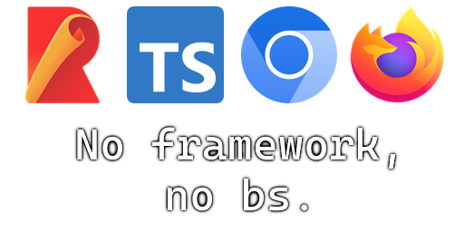

#  rollup-ts-chrome-firefox-base

Base project for Chrome and Firefox extensions using Rollup and Typescript.

## Disclaimer

> ⠀  
> This is a work in progress. I use it personally but I know it has multiple flaws. I'll probably try to improve it over time.  
> ⠀

## Usage

1. Clone this repo
2. Run `npm install`
3. Copy the polyfill from the dist folder to the src folder as per the readme in the polyfill folder
4. Run `npm run dev` to start the dev server
5. Run `npm run build` to build

Figure out packaging yourself. I haven't looked into that yet.
